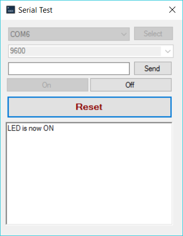

# SerialTester
SerialTester is a simple tool for sending commands to any connected serial device attached to your computer. This was initally created for issuing commands to my Arduino from my home server. I have packaged it up for anyone to make use of should the need arise.

P.S. I welcome all pull requests to drive this project forward.

## Example Arduino Sketch
Below is an exmaple Arduino sketch designed to work with `Serial Tester` to make sure that everything is working as expected.

    String readString;
    
    void setup() {
      Serial.begin(9600);
      pinMode(LED_BUILTIN, OUTPUT);
    }
    
    void loop() {
        readSerial();
    
        if (readString.length() >0) {
          if(readString.startsWith("ON")) {
            digitalWrite(LED_BUILTIN, HIGH);
            Serial.println("LED is now ON");
          }
          else if(readString.startsWith("OFF")) {
            digitalWrite(LED_BUILTIN, LOW);
            Serial.println("LED is now OFF");
          }
          else {
            Serial.print("Unknown Command: ");
            Serial.println(readString);
          }
          
          readString="";
        } 
    }
    
    void readSerial() {
      while (Serial.available()) {
          delay(3);  //delay to allow buffer to fill 
          if (Serial.available() >0) {
            char c = Serial.read();  //gets one byte from serial buffer
            readString += c; //makes the string readString
          } 
        }
    }
